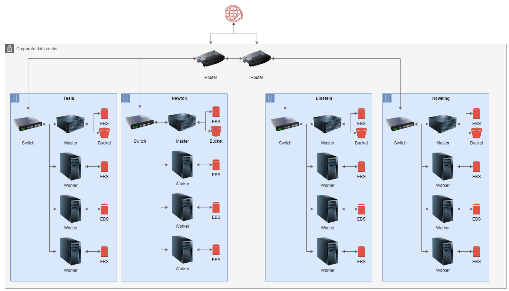

# Using automated planning in data centers fault tolerance system

> This project was my course assessment in [Automated Planning](https://github.com/pucrs-automated-planning/term-projects-2021) classroom at 2021/1.

Data centers are key components for several companies and the digital transformation increases the quantity and
the complexity of these IT assets.

Develop intelligent systems that can be used in hardware failures is an area of study of artificial intelligence.

With it in mind, we propose an automated planner to act or guide engineers in critical incidents to keep data centers healthy.

Read the full paper [here](docs/paper/paper.pdf).